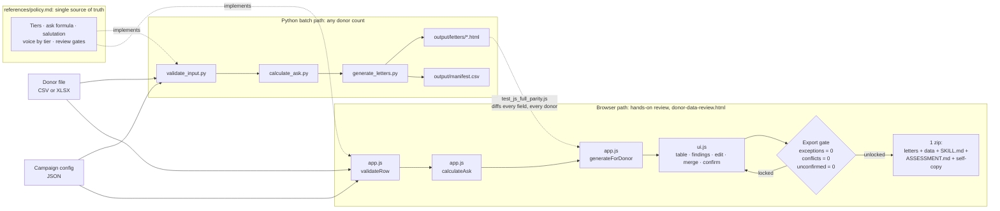

# charity-donor-outreach: assessment and rewrite

Prepared by Bryan Shaw, in response to a JLL PDS screening case study: assess
the `charity-donor-outreach` skill used by ASPCA fundraising staff to
generate personalized donor letters at scale, describe improvements and
their impact, and rewrite the skill so it produces consistent, reliable
output as the donor list grows.

## Open it now

**Live, no download: [flyguytestrun.github.io/ASPCA-Donor-Outreach](https://flyguytestrun.github.io/ASPCA-Donor-Outreach/)**

That link and [`donor-data-review.html`](donor-data-review.html) in this
repository are the same file, byte for byte, every time this repository is
updated. Whichever one you open, you get the same interactive tool, loaded
with the case study's sample data, running entirely in your browser: no
install, no server, nothing transmitted anywhere. The hosted link tends to
open more reliably than a local double-click, since some browsers restrict
how a page opened directly from disk is allowed to behave; the local file
is there for offline use and as proof the tool needs nothing but itself.

## Contents

- [Where to start](#where-to-start)
- [How this is built: two front doors, one policy](#how-this-is-built-two-front-doors-one-policy)
- [What actually happens when you run it](#what-actually-happens-when-you-run-it)
- [Running the Python pipeline](#running-the-python-pipeline)
- [Running the interactive tool locally](#running-the-interactive-tool-locally)
- [Keeping the local copy and the hosted copy in sync](#keeping-the-local-copy-and-the-hosted-copy-in-sync)
- [Layout](#layout)

## Where to start

1. **[ASSESSMENT.md](ASSESSMENT.md)** is the written answer to the brief:
   what was wrong with the original skill, why it mattered, what changed,
   a full section-by-section audit against the original's literal text
   (Part 9), and an honest account of two rounds of self-correction where
   an earlier pass of this same assessment over-edited the original rather
   than implementing it (Part 8).
2. **[donor-data-review.html](donor-data-review.html)**, live at the link
   above, is the interactive tool: one self-contained file that loads the
   sample data, recomputes tier/ask/letter live as you edit or upload data,
   and gates its own export behind resolved exceptions and confirmed
   reviews.
3. **[SKILL.md](SKILL.md)** is the rewritten skill an AI agent reads for
   the batch/automated path.
4. **[references/policy.md](references/policy.md)** is the single source
   of truth every rule below traces back to.

## How this is built: two front doors, one policy

Every rule (tiers, ask formula, salutation, voice by tier, review gates)
lives in [`references/policy.md`](references/policy.md), written once.
Two independent implementations run it, kept identical by an automated
diff test rather than by hand:

- **`scripts/*.py`**, driven by an agent through [`SKILL.md`](SKILL.md),
  for batch runs at any donor count, no browser involved.
- **`donor_rules.js` + `app.js` + `ui.js`**, driven directly by a person
  in [`donor-data-review.html`](donor-data-review.html), for hands-on
  review with no agent and no server involved. It recomputes on every
  edit, not just on load, so what you see is never stale.

[`tests/test_js_full_parity.js`](tests/test_js_full_parity.js) runs both
implementations over the same 50-donor fixture and diffs every field; if
they ever disagree, that test fails and names exactly which donor and
field.



## What actually happens when you run it

Each step below is the original skill's own instruction, followed by
exactly where it lives in this rewrite, so a claim here is always one
click from the code that makes it true.

| Step | What it does | Where |
|---|---|---|
| 1. Read the donor file | CSV or XLSX, dispatched by extension, into one shape | [`validate_input.py:read_donor_rows`](scripts/validate_input.py), [`app.js:parseCsv`](app.js) |
| 2. Verify, never trust | Every stated field (largest gift, lifetime total, tier) is recomputed from `gift_history` and compared; a disagreement is a warning, the computed value always wins | [`validate_input.py:validate_row`](scripts/validate_input.py), [`app.js:validateRow`](app.js) |
| 3. Compute tier | From lifetime giving, one deterministic lookup | [`donor_rules.py:compute_tier`](scripts/donor_rules.py), [`donor_rules.js:computeTier`](donor_rules.js) |
| 4. Compute the ask | Fixed formula, fixed operation order, full per-donor trace | [`donor_rules.py:compute_ask`](scripts/donor_rules.py), [`donor_rules.js:computeAsk`](donor_rules.js) |
| 5. Pick tone and salutation | Tier/Lapsed voice table; salutation format by tier, with a mandatory-review flag instead of a guess when a title is missing | [`generate_letters.py:build_salutation`](scripts/generate_letters.py), [`app.js:buildSalutation`](app.js) |
| 6. Assign a Platinum relationship manager | Named person signs the letter if one is on file; otherwise the campaign default signs it, visibly, under mandatory review | [`generate_letters.py:build_letter_model`](scripts/generate_letters.py), [`app.js:buildLetterModel`](app.js) |
| 7. Fill and validate the letter template | Every placeholder from verified fields, structurally checked before it ever renders | [`generate_letters.py:validate_letter_model`](scripts/generate_letters.py), [`app.js:validateLetterModel`](app.js) |
| 8. Produce one HTML letter per donor, all of them | Every donor with a valid, generated letter gets a file, not only ones a person individually clicked | [`generate_letters.py:run`](scripts/generate_letters.py), [`ui.js:allGeneratedLetterFiles`](ui.js) |
| 9. Gate before anything ships | Mandatory review (Platinum, tier corrections, ask exceeds gift, missing title, missing relationship manager, lapsed major donors) must clear before export unlocks | [`donor_rules.py:review_level`](scripts/donor_rules.py), [`ui.js:exportReadiness`](ui.js) |

## Running the Python pipeline

```
python scripts/validate_input.py --input sample-donors.csv --config references/campaign_config.example.json
python scripts/calculate_ask.py --config references/campaign_config.example.json
python scripts/generate_letters.py --config references/campaign_config.example.json
python -m unittest discover -s tests
```

`sample-donors.csv` and `sample-donors.xlsx` are the case study's original
50 donors, unchanged in value, in the file formats the pipeline actually
reads (both work identically; extension decides which reader runs).
`references/campaign_config.example.json` is a complete example campaign
configuration. `work/` and `output/` are the last run's real,
regeneratable output, kept here as evidence the pipeline runs clean: 0
exceptions, 4 tier labels corrected against their own lifetime totals, 48
letters generated, 2 lapsed Platinum donors routed to personal outreach
instead of an automated letter.

## Running the interactive tool locally

Open `donor-data-review.html` directly in a browser (double-click it, or
`file://` it), no server needed, though the hosted link above is the more
reliable way to open it. To run the JS test suites, Node is required:

```
node tests/test_js_parity.js
node tests/test_js_full_parity.js
node tests/test_app_utils.js
```

The tool auto-loads and validates the sample data on open (matches the
Python run exactly, including the 4 tier corrections and 2 lapsed-major
routes, named explicitly in its Findings panel), lets you edit any donor,
merge in more data (a file or a manual entry), and always shows what
changed in plain language before asking for confirmation. A merge
conflict (a donor_id already present) is never resolved automatically;
it's shown field by field for a person to decide. Sort any column, and
use "mark all shown reviewed" to bulk-confirm donors matching your
current filter, only after naming every one of them in a confirmation
dialog first, never silently. Every load, edit, merge, and confirmation
is recorded in an in-page change log. A numbered step tracker and a
guided tour (top of the page) walk through the whole flow.

Export is a single button, disabled until every data exception is fixed,
every merge conflict is resolved, and every flagged donor is confirmed;
the export panel names exactly what's still outstanding and links you
straight to it. Once unlocked, it produces one zip: the review manifest,
the full modified donor data, the change log, a letter for every donor
with a valid, generated letter, `SKILL.md`, `ASSESSMENT.md`, and a
working copy of the tool itself, the same package whether the person
opening it is a fundraiser or Doug reviewing this case study. The zip is
written by a small in-house zip function, no external library, verified
against Windows' native unzip and against an independent reader in the
test suite. Nothing leaves the browser at any point; a session can be
saved and reloaded as an explicit JSON file you download and re-upload
yourself, and the next run's starting data can be last run's exported
`donor-data-modified.csv`, merged against a fresh list, so the working
set carries forward without re-entering anything.

## Keeping the local copy and the hosted copy in sync

The GitHub Pages link and the file in this repository are meant to always
be the same content. That is not automatic, it is a build-and-push
sequence, done every time the tool's source changes:

1. Edit the actual source: `donor-data-review.template.html`,
   `donor_rules.js`, `app.js`, or `ui.js` (never edit
   `donor-data-review.html` directly, it is generated).
2. Rebuild: `python scripts/build_deliverable.py`. This inlines the three
   `.js` files and the sample data into the template and writes
   `donor-data-review.html`, failing loudly if any external `<script src>`
   would remain.
3. Run the full test suite (Python `unittest`, all three `node
   tests/*.js` files) and confirm everything still passes.
4. Commit and push. GitHub Pages rebuilds automatically from the pushed
   `main` branch, typically within about a minute.

## Layout

```
SKILL.md                     the skill an agent reads (batch path)
donor-data-review.html       the interactive tool (hands-on path), self-contained, built
donor-data-review.template.html  the source template (edit this, not the built file)
donor_rules.js, app.js, ui.js  the browser-side implementation (canonical source, tested directly)
scripts/                     the deterministic Python pipeline
  donor_rules.py                shared policy logic (tiers, ask math, confidence)
  validate_input.py            step 1: read, verify, recompute (CSV or XLSX)
  calculate_ask.py             step 3: deterministic ask calculation
  generate_letters.py          step 4: render letters, tone by tier
  build_deliverable.py         inlines the sample data and the three .js files into
                                the template, producing the self-contained HTML above
references/
  policy.md                    single source of truth for every rule
  campaign_config.example.json
  personalization_prompt.md    step 5's guardrails (off by default)
tests/
  test_pipeline.py             30 Python tests, stdlib only
  test_js_parity.js            JS unit tests against the same expected values
  test_js_full_parity.js       full-pipeline JS vs. Python diff on the real fixture
  test_app_utils.js            CSV round-trip, the zip writer, and letter-model checks
sample-donors.csv / .xlsx    the case study's data, as an uploaded file
ASSESSMENT.md                 the written answer to the brief
WALKTHROUGH.md                section-by-section talking points (speaker notes, not a deliverable in itself)
work/, output/                the last Python run's real output
```
